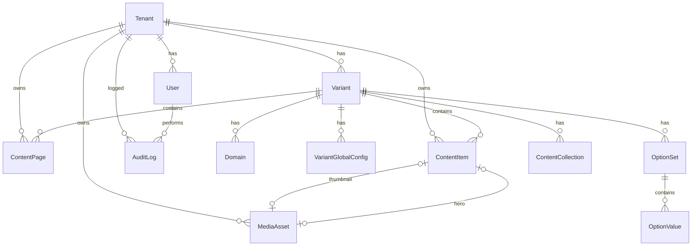

# 03 - Database

Status: Accepted v1
Tanggal: 2026-05-14
Menggabungkan: 03-database, 20-database-content-schema, 22-prisma-schema-proposal, 27-erd

## Database Principles

```text
1. PostgreSQL via Supabase — connection pooling via PgBouncer.
2. Prisma 7 sebagai ORM — type-safe, migration-first.
3. Tenant isolation via tenant_id pada semua tabel bisnis.
4. Variant sebagai data surface berbeda, bukan i18n.
5. JSON fields (dataJson) untuk konten fleksibel per section.
6. publishedDataJson untuk snapshot published — draft tidak bocor ke public.
7. cuid() sebagai ID strategy.
8. Audit log untuk semua mutasi penting.
```

## ERD



## Prisma Schema

```prisma
generator client {
  provider = "prisma-client-js"
}

datasource db {
  provider  = "postgresql"
  url       = env("DATABASE_URL")
  directUrl = env("DIRECT_URL")
}

// ─── ENUMS ────────────────────────────────────────

enum UserRole {
  SUPER_ADMIN
  TENANT_ADMIN
}

enum TenantStatus {
  ACTIVE
  SUSPENDED
}

enum VariantStatus {
  ACTIVE
  DISABLED
}

enum DomainStatus {
  PENDING
  ACTIVE
  DISABLED
}

enum PublishStatus {
  DRAFT
  PUBLISHED
  CLOSED
  FILLED
}

enum MediaType {
  IMAGE
  DOCUMENT
}

// ─── TENANT ───────────────────────────────────────

model Tenant {
  id          String       @id @default(cuid())
  name        String
  slug        String       @unique
  status      TenantStatus @default(ACTIVE)
  createdAt   DateTime     @default(now()) @map("created_at")
  updatedAt   DateTime     @updatedAt @map("updated_at")

  variants            Variant[]
  users               User[]
  mediaAssets          MediaAsset[]
  contentPages         ContentPage[]
  contentItems         ContentItem[]
  contentCollections   ContentCollection[]
  optionSets           OptionSet[]
  globalConfigs        VariantGlobalConfig[]
  auditLogs            AuditLog[]

  @@map("tenants")
}

// ─── USER ─────────────────────────────────────────

model User {
  id                String   @id @default(cuid())
  tenantId          String?  @map("tenant_id")
  username          String   @unique
  passwordHash      String   @map("password_hash")
  role              UserRole
  totpSecret        String?  @map("totp_secret")
  totpVerified      Boolean  @default(false) @map("totp_verified")
  mustChangePassword Boolean @default(false) @map("must_change_password")
  securityStamp     String   @default(cuid()) @map("security_stamp")
  isActive          Boolean  @default(true) @map("is_active")
  createdAt         DateTime @default(now()) @map("created_at")
  updatedAt         DateTime @updatedAt @map("updated_at")

  tenant                Tenant?               @relation(fields: [tenantId], references: [id], onDelete: Cascade)
  auditLogs             AuditLog[]
  updatedContentPages   ContentPage[]          @relation("ContentPageUpdatedBy")
  updatedContentItems   ContentItem[]          @relation("ContentItemUpdatedBy")
  updatedGlobalConfigs  VariantGlobalConfig[]  @relation("GlobalConfigUpdatedBy")

  @@index([tenantId])
  @@map("users")
}

// ─── VARIANT ──────────────────────────────────────

model Variant {
  id        String        @id @default(cuid())
  tenantId  String        @map("tenant_id")
  key       String
  label     String
  themeKey  String        @default("starter") @map("theme_key")
  status    VariantStatus @default(ACTIVE)
  createdAt DateTime      @default(now()) @map("created_at")
  updatedAt DateTime      @updatedAt @map("updated_at")

  tenant              Tenant                @relation(fields: [tenantId], references: [id], onDelete: Cascade)
  domains             Domain[]
  globalConfigs       VariantGlobalConfig[]
  contentPages        ContentPage[]
  contentItems        ContentItem[]
  contentCollections  ContentCollection[]
  optionSets          OptionSet[]

  @@unique([tenantId, key])
  @@map("variants")
}

// ─── DOMAIN ───────────────────────────────────────

model Domain {
  id          String       @id @default(cuid())
  variantId   String       @map("variant_id")
  host        String       @unique
  status      DomainStatus @default(PENDING)
  isPrimary   Boolean      @default(false) @map("is_primary")
  verifiedAt  DateTime?    @map("verified_at")
  createdAt   DateTime     @default(now()) @map("created_at")
  updatedAt   DateTime     @updatedAt @map("updated_at")

  variant Variant @relation(fields: [variantId], references: [id], onDelete: Cascade)

  @@index([variantId])
  @@map("domains")
}

// ─── GLOBAL CONFIG ────────────────────────────────

model VariantGlobalConfig {
  id        String   @id @default(cuid())
  tenantId  String   @map("tenant_id")
  variantId String   @map("variant_id")
  configKey String   @map("config_key")
  dataJson  Json     @map("data_json")
  updatedBy String?  @map("updated_by")
  createdAt DateTime @default(now()) @map("created_at")
  updatedAt DateTime @updatedAt @map("updated_at")

  tenant  Tenant  @relation(fields: [tenantId], references: [id], onDelete: Cascade)
  variant Variant @relation(fields: [variantId], references: [id], onDelete: Cascade)
  editor  User?   @relation("GlobalConfigUpdatedBy", fields: [updatedBy], references: [id], onDelete: SetNull)

  @@unique([variantId, configKey])
  @@index([tenantId])
  @@map("variant_global_configs")
}

// ─── CONTENT PAGE ─────────────────────────────────

model ContentPage {
  id                String        @id @default(cuid())
  tenantId          String        @map("tenant_id")
  variantId         String        @map("variant_id")
  pageKey           String        @map("page_key")
  title             String
  slug              String
  status            PublishStatus @default(DRAFT)
  dataJson          Json          @map("data_json")
  publishedDataJson Json?         @map("published_data_json")
  createdAt         DateTime      @default(now()) @map("created_at")
  updatedAt         DateTime      @updatedAt @map("updated_at")
  updatedBy         String?       @map("updated_by")

  tenant  Tenant  @relation(fields: [tenantId], references: [id], onDelete: Cascade)
  variant Variant @relation(fields: [variantId], references: [id], onDelete: Cascade)
  editor  User?   @relation("ContentPageUpdatedBy", fields: [updatedBy], references: [id], onDelete: SetNull)

  @@unique([variantId, pageKey])
  @@unique([variantId, slug])
  @@index([tenantId, variantId, status])
  @@map("content_pages")
}

// ─── CONTENT COLLECTION ───────────────────────────

model ContentCollection {
  id        String   @id @default(cuid())
  tenantId  String   @map("tenant_id")
  variantId String   @map("variant_id")
  key       String
  label     String
  isEnabled Boolean  @default(true) @map("is_enabled")
  createdAt DateTime @default(now()) @map("created_at")
  updatedAt DateTime @updatedAt @map("updated_at")

  tenant  Tenant  @relation(fields: [tenantId], references: [id], onDelete: Cascade)
  variant Variant @relation(fields: [variantId], references: [id], onDelete: Cascade)

  @@unique([variantId, key])
  @@index([tenantId])
  @@map("content_collections")
}

// ─── CONTENT ITEM ─────────────────────────────────

model ContentItem {
  id                String        @id @default(cuid())
  tenantId          String        @map("tenant_id")
  variantId         String        @map("variant_id")
  collectionKey     String        @map("collection_key")
  title             String
  slug              String
  status            PublishStatus @default(DRAFT)
  excerpt           String?
  thumbnailImageId  String?       @map("thumbnail_image_id")
  heroImageId       String?       @map("hero_image_id")
  isFeatured        Boolean       @default(false) @map("is_featured")
  publishedAt       DateTime?     @map("published_at")
  startAt           DateTime?     @map("start_at")
  expiredAt         DateTime?     @map("expired_at")
  sortOrder         Int           @default(0) @map("sort_order")
  dataJson          Json          @map("data_json")
  publishedDataJson Json?         @map("published_data_json")
  createdAt         DateTime      @default(now()) @map("created_at")
  updatedAt         DateTime      @updatedAt @map("updated_at")
  updatedBy         String?       @map("updated_by")

  tenant         Tenant      @relation(fields: [tenantId], references: [id], onDelete: Cascade)
  variant        Variant     @relation(fields: [variantId], references: [id], onDelete: Cascade)
  thumbnailImage MediaAsset? @relation("ContentItemThumbnail", fields: [thumbnailImageId], references: [id], onDelete: SetNull)
  heroImage      MediaAsset? @relation("ContentItemHero", fields: [heroImageId], references: [id], onDelete: SetNull)
  editor         User?       @relation("ContentItemUpdatedBy", fields: [updatedBy], references: [id], onDelete: SetNull)

  @@unique([variantId, collectionKey, slug])
  @@index([tenantId, variantId, collectionKey, status])
  @@index([tenantId, variantId, collectionKey, isFeatured])
  @@index([expiredAt])
  @@index([publishedAt])
  @@map("content_items")
}

// ─── OPTION SET & VALUE ───────────────────────────

model OptionSet {
  id        String   @id @default(cuid())
  tenantId  String   @map("tenant_id")
  variantId String   @map("variant_id")
  key       String
  label     String
  createdAt DateTime @default(now()) @map("created_at")
  updatedAt DateTime @updatedAt @map("updated_at")

  tenant  Tenant       @relation(fields: [tenantId], references: [id], onDelete: Cascade)
  variant Variant      @relation(fields: [variantId], references: [id], onDelete: Cascade)
  values  OptionValue[]

  @@unique([variantId, key])
  @@index([tenantId])
  @@map("option_sets")
}

model OptionValue {
  id          String   @id @default(cuid())
  optionSetId String   @map("option_set_id")
  value       String
  label       String
  sortOrder   Int      @default(0) @map("sort_order")
  isActive    Boolean  @default(true) @map("is_active")
  createdAt   DateTime @default(now()) @map("created_at")
  updatedAt   DateTime @updatedAt @map("updated_at")

  optionSet OptionSet @relation(fields: [optionSetId], references: [id], onDelete: Cascade)

  @@unique([optionSetId, value])
  @@map("option_values")
}

// ─── MEDIA ASSET ──────────────────────────────────

model MediaAsset {
  id           String    @id @default(cuid())
  tenantId     String    @map("tenant_id")
  fileName     String    @map("file_name")
  mimeType     String    @map("mime_type")
  fileSize     Int       @map("file_size")
  mediaType    MediaType @map("media_type")
  storagePath  String    @map("storage_path")
  altText      String?   @map("alt_text")
  width        Int?
  height       Int?
  createdAt    DateTime  @default(now()) @map("created_at")

  tenant             Tenant        @relation(fields: [tenantId], references: [id], onDelete: Cascade)
  contentItemsThumbs ContentItem[] @relation("ContentItemThumbnail")
  contentItemsHeroes ContentItem[] @relation("ContentItemHero")

  @@index([tenantId])
  @@map("media_assets")
}

// ─── AUDIT LOG ────────────────────────────────────

model AuditLog {
  id         String   @id @default(cuid())
  tenantId   String?  @map("tenant_id")
  userId     String   @map("user_id")
  action     String
  targetType String   @map("target_type")
  targetId   String?  @map("target_id")
  metadata   Json?
  ipAddress  String?  @map("ip_address")
  createdAt  DateTime @default(now()) @map("created_at")

  tenant Tenant? @relation(fields: [tenantId], references: [id], onDelete: SetNull)
  user   User    @relation(fields: [userId], references: [id], onDelete: Cascade)

  @@index([tenantId])
  @@index([userId])
  @@index([createdAt])
  @@map("audit_logs")
}
```

## Draft vs Published (publishedDataJson)

```text
Flow:
  Create    → dataJson = input, publishedDataJson = null, status = DRAFT
  Save draft → dataJson = update (public TIDAK berubah)
  Publish   → publishedDataJson = copy of dataJson, status = PUBLISHED, publishedAt = now()
  Edit lagi → dataJson = edit baru (publishedDataJson tetap versi lama)
  Re-publish → publishedDataJson = copy of dataJson terbaru

Reader:
  Public renderer → baca publishedDataJson (WAJIB)
  Dashboard editor → baca dataJson
  Dashboard preview → baca dataJson
```

Aturan:

- `publishedDataJson` HANYA diubah saat action Publish.
- Save draft TIDAK menyentuh `publishedDataJson`.
- Public resolver WAJIB query `status = PUBLISHED` DAN baca `publishedDataJson`.
- Jika `publishedDataJson` null → halaman belum pernah dipublish → 404 di public.

## Security Stamp (User Model)

```text
Tujuan: force-invalidate JWT session tanpa database session store.

Flow:
  Login → simpan user.securityStamp di JWT payload
  Dashboard mutation → bandingkan JWT.securityStamp vs DB user.securityStamp
  Jika berbeda → reject + force re-login

Trigger update securityStamp:
  - Suspend tenant → update semua user tenant
  - Reset password → update user
  - Reset TOTP → update user
  - Deactivate user → update user

Cost: 1 query kecil per mutation (bukan per request).
```

## Global Config Keys

### Indonesia

```text
config_key: "brand_header"     → brand, navbar, variant_switch, header_cta, header_behavior
config_key: "whatsapp_contact" → whatsapp, contact, social_links
config_key: "footer"           → brand, quick_links, program_links, contact, legal
```

### Jepang

```text
config_key: "brand_header"        → brand, topbar, navbar, header_primary_cta, header_secondary_cta, header_behavior
config_key: "line_business_contact" → line_contact, business_email, business_contact_note, business_info, documents, social_links
config_key: "footer"              → brand, company_links, resource_links, contact, legal
```

## Page Keys

### Indonesia

```text
page_key: "homepage"
page_key: "program_page"
page_key: "job_page"
page_key: "blog_page"
page_key: "tentang_kami"
page_key: "karir_page"
```

### Jepang

```text
page_key: "homepage"
page_key: "tentang_kami"
page_key: "metode_pelatihan"
page_key: "profil_kandidat"
page_key: "jaringan_rekrutmen"
page_key: "sector_page"
page_key: "news_page"
page_key: "contact"
```

## Collection Expiry Rules

```text
Job (Indonesia):
  - expired_at diset saat create/update
  - Public listing: WHERE status = PUBLISHED AND (expired_at IS NULL OR expired_at > NOW())
  - Detail page: tetap accessible via URL jika published
  - Detail page expired: tampilkan badge "Lowongan Sudah Ditutup" + disable CTA

Offer (Indonesia):
  - start_at dan expired_at diset saat create/update
  - Public listing: WHERE status = PUBLISHED AND (expired_at IS NULL OR expired_at > NOW())
  - Detail expired: badge "Penawaran Sudah Berakhir"

Karir (Indonesia):
  - Sama seperti Job

News/Sector (Jepang):
  - Tidak ada expiry
```

## Seed Specification

Saat super admin membuat tenant baru, sistem harus seed:

```text
1. Variant records:
   - { key: "indonesia", label: "Variant Indonesia", themeKey: "starter" }
   - { key: "japan", label: "Variant Jepang", themeKey: "starter" }

2. Content Collection records per variant:
   Indonesia: program, job, offer, blog, karir
   Jepang:    news, sector

3. Default Option Sets (Indonesia):
    - program_type: Magang, Tokutei Ginou, Gijinkoku, Kelas Bahasa
    - gender: Laki-laki, Perempuan, Laki-laki & Perempuan
    - education_level: SMA/SMK, D3, S1
    - language_level: N5, N4, N3, N2, N1
    - job_type: Full-time, Part-time, Kontrak
    - job_field: Manufaktur, Konstruksi, Pertanian, Perikanan, Makanan, Perhotelan, Perawatan
    - blog_category: Tips, Pengalaman, Berita, Edukasi
    - blog_tag: (seeded minimal, tenant tambah sendiri)
    - offer_type: Promo, Event, Kelas Gratis, Paket Kelas
    - target_audience: Umum, Pelajar, Fresh Graduate, Eks Jepang
    - career_department: (tenant-specific, seeded empty)
    - career_employment_type: Full-time, Part-time, Magang
    - career_work_arrangement: On-site, Hybrid, Remote

4. Default Option Sets (Jepang):
    - japan_news_category: ニュース, イベント, お知らせ, パートナー訪問, 研修活動, 候補者派遣
    - japan_news_tag: (seeded minimal, tenant tambah sendiri)
    - japan_sector_category: 製造業, 建設業, 農業, 介護, 食品加工, 外食業, 宿泊業
    - japan_candidate_pathway: 技能実習, 特定技能, 技術・人文知識・国際業務
    - japan_language_support: 日本語, English, Bahasa Indonesia

5. Content Pages (empty draft per variant, semua page_key):
   Indonesia: 6 pages
   Jepang:    8 pages

6. Global Config records (empty defaults per variant):
   Indonesia: brand_header, whatsapp_contact, footer
   Jepang:    brand_header, line_business_contact, footer
```

## Database Indexes

```text
Sudah didefinisikan di schema:
  domains.host                                      → unique (domain lookup)
  variants.tenant_id + key                          → unique (variant per tenant)
  content_pages.variant_id + page_key               → unique (1 page per key)
  content_pages.variant_id + slug                   → unique (URL routing)
  content_items.variant_id + collection_key + slug   → unique (URL routing)
  content_items.tenant_id + variant_id + collection_key + status  → composite (listing)
  content_items.tenant_id + variant_id + collection_key + is_featured → composite
  content_items.expired_at                          → single (expiry filter)
  content_items.published_at                        → single (sort by date)
  media_assets.tenant_id                            → single (tenant media)
  audit_logs.tenant_id                              → single (tenant audit)
  audit_logs.created_at                             → single (time-based query)
```

## Migration Strategy

```text
Local:
  npx prisma migrate dev --name <name>

Staging:
  npx prisma migrate deploy (via CI/CD or manual)

Production:
  npx prisma migrate deploy (via CI/CD)
  ALWAYS use DIRECT_URL for migrations (bypass PgBouncer)

Rollback:
  Prisma tidak support auto-rollback.
  Siapkan manual DOWN migration SQL untuk setiap migration kritis.
  Test migration di staging sebelum production.
```

## Not In MVP

```text
- Soft delete (cukup audit log)
- Content versioning history (cukup draft/published)
- Full-text search (cukup filter by option set)
- Database RLS (cukup app-level tenant filtering)
- Materialized views
- Database triggers
- Partitioning
```
